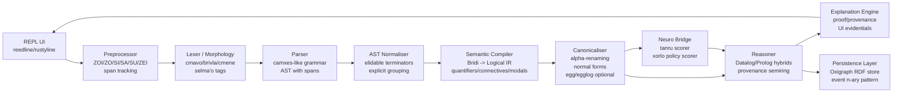
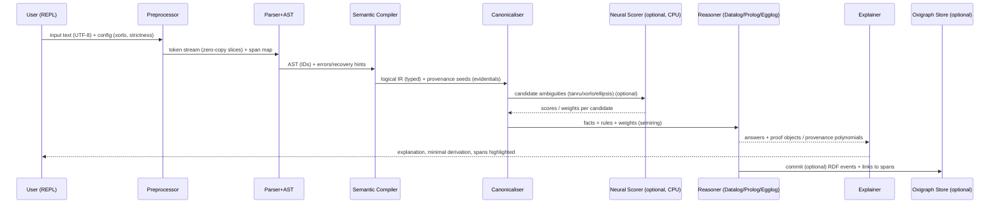

# Building a Lojban Neuro‑Symbolic Engine in High‑Performance Rust

## Executive summary

This report proposes a CPU‑first, interactive‑REPL v1 architecture for a **Lojban neuro‑symbolic engine** that transforms Lojban text into a **typed logical intermediate representation (IR)**, runs **symbolic reasoning** (Datalog/Prolog/e‑graphs), and optionally integrates **differentiable components** for ambiguity resolution and semantic scoring. The design is driven by Lojban’s unusually explicit grammatical machinery (cmavo/selma’o, elidable terminators, explicit connectives/quantifiers, quotation and erasure operators), which makes it feasible to build a pipeline that is both **formally grounded** and **explainable** when done carefully. Lojban’s core “bridi” structure corresponds closely to predicate logic: a bridi relates arguments (sumti) via a relational core (selbri), and quantifier constructs like **prenex + zo’u** give explicit variable binding and scope mechanisms. citeturn36search6turn29search5

Key points:

- **Lojban surface features that matter for an engine**  
  The engine must treat quotation/erasure and word‑gluing as first‑class operations. CLL explicitly specifies **ZO** (quote next word), **ZOI** (quote arbitrary non‑Lojban text delimited by a user‑chosen delimiter word), **SI/SA/SU** (erasure operators, including the special rule that erasing a `zo` quotation requires multiple `si`), and interactions including **ZEI** word‑gluing (forming a lujvo‑like unit) and what it does *not* affect. citeturn24search2  
  Another critical dimension is **tanru**: their syntax is unambiguous (grouping rules such as default left‑grouping exist), but their *meaning is explicitly ambiguous*—a key driver for neuro‑symbolic disambiguation modules. citeturn27search7turn27search0  
  For gadri (“articles”), **xorlo** materially changes how bare `lo`/`le` are interpreted and removes older default‑quantifier assumptions; your engine should treat this as a configurable semantic regime rather than a single “true” semantics. citeturn24search0

- **Neuro‑symbolic integration patterns worth prioritising**  
  Three complementary patterns are particularly relevant:  
  **Scallop‑style differentiable Datalog with provenance semirings** (for weighted, explainable reasoning and differentiable proof selection), citeturn8view0turn6search0turn4search1  
  **LNN/LTN differentiable logic** (for constraint‑based learning and reasoning over graded truth in first‑order logic formulations), citeturn8view1turn9view0  
  **egg/egglog equality saturation + Datalog unification** (for canonicalisation, algebraic rewrites, and optimisation/explanation over equivalence classes). citeturn9view1turn18search0turn18search1

- **Rust implementation strategy**  
  Rust is suitable because performance‑critical components (tokenisation, parsing, interning, arenas, reasoning dataflow) can be implemented with **tight memory control** and predictable layouts (e.g., `Vec<T>` as a contiguous array type). citeturn21search0turn12search2  
  The recommended approach: use **interning + arenas** for AST/IR, **SoA‑leaning layouts** for hot relations, and **Rayon** for CPU parallelism where the workload warrants it. citeturn13search6turn13search1turn11search2  
  Profiling/benchmarking rigor should follow established Rust practice: Criterion for statistically robust micro‑benchmarks, flamegraphs and sampling profilers for hotspots, and allocation/type‑size analysis to reduce cache pressure and memory traffic. citeturn14search0turn14search3turn15search0turn20search2turn20search5

Assumptions explicitly adopted for v1 (per your clarification): **CPU‑only** and **interactive REPL** UX. Items not specified by you (hardware class, latency targets, scope of reasoning, training budget, etc.) are listed explicitly in the final section.

## Background and literature review with primary sources

### Lojban linguistic features relevant to a reasoning engine

**Bridi and place structure as predicate logic scaffolding.**  
CLL introduces bridi as the core relational unit: a bridi is a predication whose arguments are sumti and whose relational nucleus is the selbri. citeturn36search6 This maps naturally to an **n‑ary predicate** in logic or a relational atom in Datalog. A practical engineering implication is that the semantic compiler should not merely output “parse trees”; it should output a **typed, place‑indexed predicate application** plus metadata for tense/modals, connectives, and attitudes/evidentials.

**Quantification and explicit binding with zo’u prenexes.**  
CLL’s treatment of **prenex + `zo’u`** provides an explicit, machine‑checkable mechanism for binding variables and controlling scope. Example `da zo'u da viska mi` asserts existence (“there exists X such that…”). citeturn29search5 The CLL also defines when a prenex can be dropped (prenex elision rules), which is important for canonicalisation and for normal‑form compilation. citeturn29search0  
For a reasoning engine, this supports a strategy of compiling to a normal form such as:
- prenex normal form (if present), then
- a conjunction/disjunction structure of bridi clauses, and
- explicit variable references.

**Logical connectives as a complete truth‑functional system.**  
CLL (Chapter 14) defines a systematic connective inventory: there are **16 truth functions**, with four treated as fundamental (A/E/O/U), and multiple connective “families” (A, GA, GIhA, GUhA, JA…) to avoid grammatical ambiguity. citeturn28search0turn28search3 This regularity is a gift for compilers: you can compile connectives into a small core algebra plus transformations (negation swapping, argument swapping) and preserve explainability.

**Morphology and word classes.**  
CLL distinguishes cmavo, brivla, and cmene, and provides morphological characteristics for brivla (e.g., ending in a vowel, penultimate stress, consonant cluster constraints), which can be used for robust token classification and error reporting. citeturn26search2turn26search0  
In practice, you may still rely on established machine grammars; BPFK’s PEG morphology algorithm explicitly targets morphological classification into cmavo/gismu/lujvo/fu’ivla/etc. citeturn2search5

**Tanru: syntactically regular, semantically ambiguous.**  
CLL is explicit that tanru meaning is “usually at least partly ambiguous”, and while the syntax/grouping is unambiguous, semantics remains flexible. citeturn27search0turn27search7 This is a prime place for neuro‑symbolic integration: the symbolic layer provides structure and constraints; the neural layer scores interpretations.

**ZO/ZOI/LA’O quotations, SI/SA/SU erasure, and ZEI word‑gluing.**  
CLL’s Chapter 19 details quotations (ZO, ZOI) and erasure (SI/SA/SU), including operational interactions and exceptions (e.g., ZEI combines adjacent words but “does not affect” multiple meta‑operators). citeturn24search2 This is operationally significant: preprocessing cannot be a trivial whitespace split, and parser recovery must understand that some tokens alter the stream.

**Elidable terminators and canonicalisation.**  
CLL provides a full catalogue of terminators that may be elided (e.g., `ku` for descriptions, `kei` for abstractions, `ku'o` for relative clauses, `vau` for bridi tails). citeturn25search0turn25search3 For robust reasoning and stable downstream forms, your compiler should be able to **reconstruct elided terminators** in a canonical IR, while preserving original spans for explanations.

**Xorlo as a semantic regime change.**  
The xorlo proposal changes how gadri like `lo` are used/interpreted, emphasising that `lo` becomes “completely generic” and that older default‑quantifier readings are not assumed. citeturn24search0 For an engine, xorlo implies you should not hard‑code older quantifier defaults; instead, represent gadri semantics as **configurable policies**.

**Evidentials as built‑in provenance signals.**  
CLL defines evidentials (UI selma’o) as marking the information source (observation, hearsay, opinion, conclusion, etc.). citeturn35search0 This naturally aligns with provenance‑aware reasoning: evidentials can seed provenance annotations that propagate through inference and explanation (with clear caveats about what “indisputable” means rhetorically vs logically).

### Neuro‑symbolic architectures and reasoning backends

**Provenance semirings as the unifying algebra.**  
Green, Karvounarakis, and Tannen show that provenance for relational algebra and Datalog can be expressed via **semirings**, motivating a general framework for provenance calculation and query evaluation variants. citeturn4search1 This is directly relevant if you want your Lojban engine to produce **explanations that are compositional** (why‑provenance; confidence propagation) and to unify discrete vs probabilistic vs differentiable interpretations.

**Scallop: differentiable Datalog based on generalized provenance semirings.**  
Scallop combines Datalog (recursion, aggregation, negation) with differentiable reasoning “based on the theory of provenance semirings”. citeturn8view0 The Scallop implementation also emphasises integration with PyTorch and configurable semirings for discrete/probabilistic/differentiable reasoning. citeturn6search0  
For your engine, Scallop is a strong reference model for “neural scores in, weighted proofs out”.

**LNN and LTN: differentiable logic constraints for interpretable reasoning.**  
Logical Neural Networks (LNNs) frame neurons as components of formulas in a weighted real‑valued logic, with omnidirectional inference and end‑to‑end differentiability, including first‑order theorem proving as a special case. citeturn8view1  
Logic Tensor Networks (LTNs) introduce “Real Logic”, a many‑valued, differentiable first‑order logic as a representation language enabling learning and reasoning in one computational graph. citeturn9view0  
For Lojban, these approaches fit naturally when you encode linguistic/semantic constraints (type constraints, place‑structure constraints, discourse constraints) and train neural components to satisfy them.

**egg and egglog: equality saturation meets Datalog.**  
`egg` is a Rust e‑graph library optimised for equality saturation. citeturn18search0 egglog explicitly aims to unify Datalog and equality saturation, supporting incremental execution, lattice‑based reasoning, term rewriting, congruence closure, and extraction of optimised terms. citeturn9view1turn18search1  
For your system, egg/egglog is highly relevant to canonicalisation and optimisation of logical forms (e.g., normalising connective structures, rewriting equivalent quantifier placements under safe rules, simplifying tanru internal rewrites where licensed).

### Rust ecosystem primitives relevant to HPC, safety, and extensibility

- **Parsing**: pest provides grammar‑level features like `PUSH`/`POP`/`PEEK` for stack‑based matching, which is relevant for delimiter‑driven constructs. citeturn10search0 Nom focuses on safe, streaming‑friendly, **zero‑copy** parsing. citeturn10search1 Chumsky emphasises expressive combinators and “zero‑copy parsing” outputs holding input slices. citeturn10search4 LALRPOP is an LR(1) parser generator with grammar macros and error support. citeturn10search3
- **Parallelism**: Rayon offers data‑parallel iterators and safe data‑parallelism. citeturn11search2
- **Async**: Tokio’s model formalises futures/executors for async Rust; while v1 can be sync, Tokio is worth planning for when you add REPL servers or background tasks. citeturn11search0turn11search1
- **SIMD**: `std::arch` exposes architecture‑specific intrinsics and is explicitly non‑portable. citeturn12search0
- **Memory and data layout**: `Vec<T>` is a contiguous growable array and guarantees contiguous elements when allocated. citeturn21search0 Rust’s ownership/borrowing model enables safe reference‑based pipelines. citeturn12search2
- **Interning/arenas/unification**: bumpalo provides fast bump allocation suitable for phase‑oriented allocations. citeturn13search1 Id‑based arenas (id‑arena) provide stable IDs for graph‑like structures. citeturn13search0 Ena provides union‑find plus snapshot/rollback utilities—valuable for unification and backtracking. citeturn13search7 Lasso provides single‑ and multi‑threaded string interning with contention‑free reader/resolver modes. citeturn13search6
- **Serialization**: Serde is the standard trait‑based serialisation/deserialisation framework. citeturn16search1
- **Persistence/query**: Oxigraph is a Rust graph database library implementing SPARQL 1.1 and RDF serialisation formats; it also notes query evaluation is not yet optimised. citeturn16search9
- **ML runtimes**: Candle is a minimalist Rust ML framework focused on performance and ease of use (CPU‑capable, GPU optional later). citeturn16search0 `ort` is a safe wrapper around ONNX Runtime for hardware‑accelerated inference/training. citeturn16search6 Burn emphasises performance features (kernel fusion, async execution, memory management) and portability. citeturn17search0

## Proposed architecture with mermaid diagrams

### Architectural goals for v1 (CPU REPL)

The v1 system should:

- Accept Lojban input interactively (REPL) and provide: parse tree, semantic IR, reasoning results, and **explanations** (derivations/provenance).
- Be robust to core metalinguistic operators (ZO/ZOI/SI/ZEI), elidable terminators, and tanru grouping.
- Produce stable, canonical IR suitable for:
  - Datalog facts (for forward chaining / query),
  - optional e‑graph rewrites (for canonicalisation / optimisation),
  - later differentiable scoring of ambiguities (tanru, xorlo policy, ellipsis).

### Component diagram

### Dataflow diagram (single query)

### Persistence design note: events and reification

Because RDF properties are **binary relations**, representing many‑argument bridi/events in a triple store typically requires an **n‑ary relation pattern** (introducing a node representing the relation instance, then linking participants via properties). citeturn22search0 This aligns with the idea of “event reification” for bridi instances: create a `:BridiEvent` node per bridi occurrence and attach `:hasSelbri`, `:hasSumtiRole`, `:hasSpan`, etc.

Oxigraph is a suitable embedded store for this, but its own documentation warns that SPARQL evaluation is “not optimised yet”, so v1 should treat persistence as optional or lightweight. citeturn16search9

## Mapping Lojban constructs to symbolic representations and neural responsibilities

This section defines a pragmatic mapping that preserves **formal handles** (place structure, connectives, quantifiers) while acknowledging where semantics is intentionally underdetermined (tanru; xorlo).

### Core symbolic representations

**Logical IR primitives (suggested)**

- **Terms**
  - `Const(Symbol)` for names/cmevla and quoted atoms (`zo broda`)
  - `Var(VarId)` for bound variables (`da`, `de`, …)
  - `Descr { gadri, selbri, restrictors }` for description sumti (`lo prenu`, `le gerku poi blabi`)
  - `Quote { kind, payload }` for ZOI/LA’O and other quote constructs

- **Predications**
  - `Bridi { selbri: PredSym, args: Vec<Term>, tags: Vec<Tag>, evidentials: Vec<Evidential> }`

- **Logic structure**
  - `And/Or/Not/Implies/Iff` based on CLL truth‑functions and connective families citeturn28search3turn28search0
  - `Quant { q, var, domain?, body }` based on prenex + zo’u rules citeturn29search5turn29search0

- **Provenance**
  - `Prov` as an element of a semiring (e.g., boolean, probability, proof polynomial) per Green et al. citeturn4search1  
  - Seeded from:
    - evidentials (UI) as “source annotations” citeturn35search0
    - neural scores (tanru/xorlo) as weights

### Construct‑by‑construct mapping and what should be neural

**Bridi and place structure → n‑ary predicate / relational atom**  
- Symbolic: `selbri(args...)` where each place `x1..xn` is an argument position. This matches CLL’s bridi framing. citeturn36search6turn36search0  
- Neural: typically **not required** for strict structural mapping, but may be used to:
  - resolve elided places (when the user omits places intentionally; ellipsis is common) and propose likely fillers (as suggestions, not assertions). The Lojban overview notes ellipsis is common and can be queried/clarified. citeturn36search0

**Prenex + zo’u → explicit quantifier binding**  
- Symbolic: compile prenex into explicit quantifier nodes; preserve original order and apply CLL prenex‑dropping rules only in a canonicaliser, not in parsing. citeturn29search5turn29search0  
- Neural: optional “readability” suggestions (e.g., propose more idiomatic non‑prenex surface forms) but semantics should remain symbolic/deterministic.

**Truth‑functional connectives → boolean algebra / normal forms**  
- Symbolic: compile connective tokens (A/GA/GIhA/JA etc.) into a uniform core (truth tables / boolean ops) using CLL’s truth‑function system. citeturn28search0turn28search3  
- Neural: generally unnecessary; avoid introducing stochasticity into a deterministic connective system.

**Tanru → structured predicate composition with ambiguous semantic relation**  
- Symbolic: represent tanru grouping deterministically (e.g., default left‑grouping, explicit `bo/ke…ke’e`), as CLL specifies. citeturn27search7turn27search0  
- Neural: **primary responsibility**. Predict:
  - the semantic relation type between modifier and head (e.g., “user‑of” vs “computer‑that‑uses”), since CLL states tanru meaning is “usually at least partly ambiguous”. citeturn27search0  
  - candidate expansions into more explicit bridi if you support that.

A practical representation is:
- `Tanru(head, modifiers[], groupingTree)` symbolically, plus
- `TanruInterpretation { relation_label, score, derived_predication }` from neural scorer.

**Gadri and xorlo policy → configurable semantics, optionally neural scoring**  
- Symbolic: represent gadri (`lo/le/la`, masses/sets) explicitly; track whether xorlo policy is active. CLL explains baseline descriptors (le/lo/la) and terminator `ku`. citeturn25search3turn25search0  
- Neural: optional, but useful if you want the engine to guess user intent under xorlo’s intentionally broad `lo`. Xorlo explicitly removes older default quantifiers and treats `lo` as generic. citeturn24search0  
Recommendation: in v1, make xorlo a **user‑selectable semantic mode**, and make any “intent inference” clearly labelled as a suggestion.

**Evidentials (UI) → provenance seeds**  
- Symbolic: attach evidential tags to bridi as provenance metadata. CLL defines evidentials as indicating information source. citeturn35search0  
- Neural: not necessary; evidentials are explicit.

**ZO/ZOI/LA’O, SI/SA/SU, ZEI → preprocessing and token‑stream rewriting**  
- Symbolic: treat these as **operations on the token stream** before parsing and/or as special AST nodes that suppress normal grammatical effects. CLL specifies:
  - `zo` quotes the next word, with no terminator citeturn24search2
  - `zoi` uses a delimiter word and quotes non‑Lojban text until the closing delimiter citeturn24search2
  - `si` erases the preceding word; special handling is required around `zo` quotations citeturn24search2
  - `zei` glues the preceding and following word into a lujvo‑like unit and has explicit exclusions citeturn24search2turn26search0  
- Neural: not appropriate; these are deterministic formal operators.

**Concrete examples**

Example A: quotation and erasure

Input:
- `zo si cu lojbo valsi` (from CLL example) citeturn24search2

Symbolic mapping:
- Preprocessor emits `QuotedWord("si")` tagged as “metalinguistic”, preventing it from acting as the erasure operator in the surrounding sentence.
- Semantic IR: `lojbo_valsi("si")` (or `WordIsLojbanic("si")`) with provenance = unit.

Example B: ZOI delimiter quotation

CLL: `zoi X. text .X` where X is a delimiting word separated by pauses and not occurring inside the quoted text. citeturn24search2

Symbolic mapping:
- Token: `Quote { kind: ZOI, delim: X, payload: "text" }`
- IR can treat payload as opaque string or as foreign‑language text for later pipelines.

Implementation note: this is easiest as a **preprocessor state machine** rather than a context‑free grammar rule.

Example C: tanru ambiguity driving neural scoring

CLL notes: `skami pilno` can mean “computer that is a user” or “user of computers”. citeturn27search0

Representation:
- Symbolic: `Tanru(head=pilno, mod=skami, grouping=left)`
- Neural: produce candidate interpretations:
  - `user_of(pilno, skami)` score 0.62
  - `computer_user(pilno, skami)` score 0.38
- Reasoner: choose best under constraints, or keep both under a provenance semiring (see Scallop/provenance approach). citeturn8view0turn4search1

## Implementation roadmap with milestones, estimates, and risks

Estimates are in **person‑weeks** (pw) and assume experienced Rust engineers. Because compute targets and team size are unspecified beyond “CPU‑only, REPL v1”, these are best‑effort planning numbers; adjust once hardware/SLOs are known.

| Milestone | Scope and deliverables | Est. effort (pw) | Major risks | Mitigations |
|---|---|---:|---|---|
| REPL scaffolding | CPU REPL with command system; load config (xorlo on/off); show spans | 2 | UX churn; unclear commands | Start minimal: `:parse`, `:ir`, `:query`, `:explain` |
| Preprocessor correctness | Implement ZO/ZOI/LA’O, SI/SA/SU, ZEI rewrite rules + spans; golden tests from CLL examples (zo/si triple‑si, etc.) citeturn24search2 | 4 | Edge cases (nested quotes, delimiter collisions) | Deterministic state machine; property‑based tests; strict mode |
| Morphology + token tagging | cmavo/brivla/cmevla classification, selma’o tagging hooks; optionally incorporate PEG morphology references citeturn26search0turn2search5 | 4 | Grammar drift; incomplete coverage | Versioned grammar baseline; regression corpora |
| Parser + AST | Implement/port a camxes‑like grammar; AST IDs + span retention; error recovery | 6–10 | Hard to match “real” usage; ambiguity vs strictness | Separate “strict CLL” vs “permissive” mode; extensive tests |
| Semantic compiler | AST → logical IR: bridi/places, connectives, quantifiers/prenex, terminator reconstruction citeturn29search5turn25search0turn28search3 | 8–12 | Semantic corner cases; scope mistakes | Canonical forms; staged IR validation; round‑trip checks |
| Canonicaliser | Alpha‑rename vars; normalise connectives; optional egg/egglog rewrites citeturn18search0turn18search1turn9view1 | 6 | Unsound rewrites if constraints wrong | Maintain “soundness proofs” for rewrites; test suite |
| Reasoning engine v1 | Embed Datalog (Ascent) + optional Prolog queries; provenance hooks citeturn17search4turn17search5turn4search1 | 6–10 | Performance surprises; explanation complexity | Start with small rule set; add provenance incrementally |
| Neuro bridge v1 (CPU) | Plug‑in neural scorer interface; support Candle CPU or ONNX via `ort`; inference only citeturn16search0turn16search6 | 6–12 | Model quality; data scarcity | Start with tanru scorer only; synthetic data generation |
| Persistence (optional) | Store IR/events in Oxigraph; SPARQL query hooks; n‑ary event pattern citeturn16search9turn22search0 | 4–8 | Oxigraph perf; schema design | Keep optional; write‑behind + caching; don’t block REPL |
| Hardening + release | Perf budgets, docs, CI/CD, reproducible binaries | 4–6 | Hidden perf cliffs | Systematic profiling plan (below) |

## Performance engineering plan and profiling strategy

### Performance targets and constraints

Explicitly **unspecified** (you did not provide latency/throughput SLOs, hardware class, memory limits). For v1 REPL, the typical practical target is “interactive” response (human‑perceived), but this must be made explicit later.

### Benchmarking strategy

Use a two‑tier benchmark approach:

- **Microbenchmarks (component‑level)** using **Criterion**, which is statistics‑driven and designed to detect small regressions with confidence. citeturn14search0  
  Bench candidates:
  - preprocessing (ZOI scanning, SI erasure)
  - morphology classification
  - parsing (short/medium/long sentences)
  - AST→IR compilation
  - canonicalisation and rewrite passes
  - reasoning query time for representative rule sets

- **Scenario benchmarks (end‑to‑end)**: parse+compile+reason for representative texts (short single bridi; multi‑sentence with prenex; tanru‑heavy corpora).

### Profiling and hotspot discovery

Follow The Rust Performance Book’s guidance: profiling is key to identify hot code paths; use tools like `perf`, flamegraph tooling, and allocation profilers (DHAT) as appropriate. citeturn15search0turn20search5  
Recommended workflow:

1. **Release‑like builds with debug line tables** to retain useful source mapping when sampling hot code. citeturn15search0  
2. Use **cargo‑flamegraph** to generate flamegraphs (perf/DTrace based), especially for parsing and reasoning hotspots. citeturn14search3turn15search0  
3. Track memory pressure by:
   - reducing heap allocations (DHAT / heap profiling), citeturn20search5
   - shrinking hot types to reduce memory traffic and cache pressure; Rust Performance Book notes that shrinking frequently instantiated types can reduce memory traffic and “cache pressure”. citeturn20search2

### Data‑layout and allocation principles (practical choices)

- Prefer **interned symbols** and stable integer IDs in hot paths:
  - string interning with lasso (fast lookup, contention‑free resolver/reader modes). citeturn13search6
- Prefer **arena allocation** for phase‑oriented data (parse/compile phases):
  - bumpalo provides bump arenas suitable for phase allocation. citeturn13search1
- Maintain cache‑friendly storage:
  - use `Vec<T>` for contiguous storage of hot arrays; `Vec` is explicitly contiguous. citeturn21search0  
  - represent relations in a SoA‑like shape when columns are accessed independently (e.g., `pred_id: Vec<PredSym>`, `arg1: Vec<TermId>`, …), reducing cache pressure (tie this to the “reduce memory traffic/cache pressure” objective). citeturn20search2turn21search0
- Parallelism:
  - Apply Rayon to coarse‑grained tasks (batch parsing, batch reasoning) where work is independent. Rayon provides parallel iterators and safe data parallelism. citeturn11search2
- SIMD:
  - Defer explicit SIMD until profiling proves it matters. If needed, use `std::arch` intrinsics with strict `cfg(target_arch)` gating because they are architecture‑dependent and not portable. citeturn12search0

## Dataset plan and synthetic data generation

### Public corpora and lexical resources

- **jbovlaste**: dictionary data is explicitly stated as public domain, and it provides an XML export endpoint (useful for building lexical tables, rafsi/selma’o mappings, etc.). citeturn1search3
- **BPFK text corpus**: corpus.lojban.org provides a directory of Lojban texts and metadata (but licensing varies by source; treat as **license‑uncertain** until audited per document). citeturn1search2
- **Tatoeba parallel sentences**: downloads are released under **CC BY 2.0 FR**, with additional notes that part of the content may be under CC0 and that audio licensing differs. citeturn3search0turn3search1  
  For Lojban work, Tatoeba can provide aligned translations (where present) to train disambiguation or mapping models, but you must implement attribution and filter licensing‑issue data as needed.

- **Machine grammars / parsers**:
  - ilmentufa is a syntactic (not semantic) parser project and is a practical reference for parse coverage strategies. citeturn30search4
  - camxes ecosystem references include known corner cases around ZOI payloads (useful for stress testing quote handling). citeturn30search9
  - PEG morphology algorithm references help classify words and selma’o categories. citeturn2search5

- **xorlo documentation** for gadri semantics changes: use as a labelled “semantic mode” baseline for evaluation. citeturn24search0

### Synthetic data generation methods (high leverage for v1)

Given that tanru semantics and disambiguation tasks are data‑hungry, synthetic generation is essential.

- **Grammar‑guided generation**
  - Generate structurally valid bridi using a constrained generator over:
    - selbri from jbovlaste gismu/lujvo lists citeturn1search3
    - sumti forms including descriptors and relative clauses (respecting elidable terminators list for canonical forms). citeturn25search0turn25search3
  - Ensure generators incorporate quotation/erasure operators according to CLL operational rules (ZO/ZOI/SI/ZEI). citeturn24search2

- **Schema‑guided semantic generation**
  - Sample a predicate schema (place structure) and generate:
    - canonical bridi with all places filled
    - ellipsis versions leaving selected places implicit (to train “suggested fillers”)
  - For quantifiers, generate prenex + dropped‑prenex pairs using CLL rules. citeturn29search0turn29search5

- **Tanru interpretation pairs**
  - For a generated tanru `X Y`, generate two or more paraphrases (in a controlled metalanguage, e.g., English templates or a structured label system) corresponding to different relationships, acknowledging CLL’s explicit ambiguity of tanru semantics. citeturn27search0

- **Provenance/evidential augmentation**
  - Add evidential markers to the same base bridi to test provenance propagation in explanations (observe vs hearsay vs opinion). citeturn35search0

## Evaluation metrics and test suites

### Stage‑wise metrics (recommended)

Because the engine is a pipeline, you want **metrics per stage**, plus end‑to‑end metrics.

**Preprocessor (ZO/ZOI/SI/ZEI correctness)**
- Exact‑match token stream after applying deterministic rewrite rules (golden tests).
- Span preservation accuracy (each output token maps to a valid source span set).
- Property‑based tests: e.g., ZOI quoted payload must not be interpreted as Lojban tokens until closing delimiter, consistent with CLL’s delimiter design. citeturn24search2

**Morphology/lexing**
- Word‑class classification accuracy (cmavo/brivla/cmene) using morphological rules and PEG morphology reference sets. citeturn26search0turn26search2turn2search5
- Selma’o tagging coverage (percentage of tokens assigned; “unknown selma’o” rate).

**Parsing**
- Parse success rate on curated corpora (permissive vs strict modes).
- Structural invariants: terminator insertion/removal should preserve parse up to equivalence classes (elidable terminators list). citeturn25search0

**Semantic compiler**
- IR well‑typedness: every bridi has arity/roles assigned, every connective compiles to a truth function structure consistent with CLL. citeturn28search0turn28search3
- Quantifier scope tests: prenex binding, prenex dropping, and variable ordering correctness. citeturn29search5turn29search0
- Xorlo mode tests: gadri semantics should differ only where expected; treat as separate evaluation regimes. citeturn24search0

**Reasoning**
- Query correctness on hand‑crafted gold standards.
- Explanation quality:
  - minimal proof size (nodes/edges),
  - provenance completeness (all supporting facts accounted for),
  - stability under refactoring (canonicalisation should not change meaning).

**Tanru disambiguation (neural)**
- Top‑k accuracy over labelled interpretations.
- Calibration metrics (ECE/Brier) if you treat scores probabilistically.
- Robustness: invariance to elidable terminators and benign rephrasings. citeturn25search0turn27search7

### Suggested test suite sources

- **CLL‑derived example tests** for quoting/erasure, tanru grouping, prenex rules, elidable terminators. citeturn24search2turn27search7turn29search0turn25search0
- **Corpus regression**: BPFK corpus for “real text” parse/regression, subject to licensing audit per document. citeturn1search2
- **Parser corner cases**: camxes wiki notes issues involving ZOI payload encoding, useful for stress tests. citeturn30search9

## Recommended Rust crates, libraries, and FFI strategies

### Parser and front‑end choices (comparison)

| Option | Strengths for this project | Weaknesses / risks | When to pick |
|---|---|---|---|
| pest | Grammar‑driven PEG with special rules like `PUSH/POP/PEEK` (useful for some context‑sensitive matching). citeturn10search0 | PEG choices are ordered; complex grammars can become subtle; may not be the fastest for all workloads | If you want grammar clarity and can keep preprocessor heavy |
| nom | Safe, streaming‑friendly, “as much as possible zero copy”. citeturn10search1 | Grammar is embedded in Rust code; can be harder to maintain for large grammars | If performance and explicit control dominate |
| chumsky | Expressive combinators; advertises “zero‑copy parsing” and error recovery. citeturn10search4 | Type complexity; large grammars can get heavy | If you want good errors + flexible front‑end |
| LALRPOP | LR(1) generator; grammar macros; good structure for CFG‑style grammars. citeturn10search3 | Lojban has operational preprocess rules (ZOI/SI/ZEI) that you’ll still handle outside | If you want a classic grammar toolchain once preprocessing is done |

**Recommendation for v1**: treat **preprocessing as definitive** for ZO/ZOI/SI/ZEI, then choose **nom or chumsky** for performance and span‑rich parsing, unless your team strongly prefers grammar files (then pest is reasonable). The determinism of CLL’s operator interactions makes preprocessing a higher‑risk correctness surface than the parser generator itself. citeturn24search2

### Memory management and data structures

- **String/symbol interning**: lasso for internment with both single‑ and multi‑threaded interners, plus contention‑free resolver modes. citeturn13search6
- **AST/IR arenas**:
  - bumpalo for fast phase allocation, ideal for parse/compile phases. citeturn13search1
  - id‑arena for stable IDs, useful for graphs and mutation without borrow issues. citeturn13search0
  - ena for unification and snapshot/rollback (useful for constraint solving and backtracking). citeturn13search7
- **Cache‑friendly storage**:
  - use `Vec<T>` for contiguous hot arrays. citeturn21search0
  - keep hot structs small; shrinking types can reduce cache pressure. citeturn20search2

### Symbolic reasoning backends

- **Datalog in Rust**: Ascent provides Datalog‑style logic programming via macros and supports lattice concepts (useful if you model graded facts). citeturn17search4
- **Prolog embedding**: Scryer Prolog exposes a Prolog machine and query iteration; useful for interactive querying and explanation prototypes. citeturn17search5
- **Equality saturation/canonicalisation**:
  - egg: e‑graph equality saturation library. citeturn18search0
  - egglog: successor language/system, positioned as “faster and more general” and tied to the egglog PLDI work combining Datalog + equality saturation. citeturn18search1turn9view1

### Neuro bridge options (CPU‑first)

- **Candle (Rust‑native)**: a minimalist Rust ML framework focused on performance and ease of use; suitable for CPU inference in v1 and GPU later if needed. citeturn16search0
- **ONNX Runtime via `ort` (FFI)**: safe wrapper for ONNX Runtime; good when you want to train/export in Python and deploy in Rust. citeturn16search6
- **Burn (future‑leaning)**: deep learning framework emphasising performance techniques (kernel fusion, async execution, memory management). citeturn17search0

### Serialization and persistence

- **Serde** for IR/config serialisation. citeturn16search1
- **Oxigraph** for optional persistence/querying of semantic graphs (SPARQL 1.1). Note its performance caveat. citeturn16search9  
- Use W3C n‑ary relation patterns for bridi/event storage. citeturn22search0

### REPL and developer UX crates (CPU v1)

- For a rich interactive editor, **reedline** provides a modern line editor with multiline, completion, syntax highlighting, and is designed for interactive shells. citeturn34search3  
- For CLI parsing, **clap** provides a polished CLI experience with derive/builder APIs. citeturn34search0  
- For structured tracing, **tracing** provides spans/events and is designed to work well with async execution (useful even in sync REPL for structured diagnostics and causal context). citeturn14search1

## Deployment, CI/CD, and legal/ethical considerations

### Deployment recommendations for v1 (CPU REPL)

- Ship as a native binary with:
  - `lojbanrepl` interactive mode (default)
  - batch mode: `lojbanrepl :parse file`, `:query`, etc.
- Keep persistence optional:
  - default in‑memory store for fast iteration
  - enable Oxigraph via a feature flag, warning users about early optimisation state. citeturn16search9

### CI/CD recommendations (CPU‑first)

- Unit + golden tests for preprocessing semantics (ZO/ZOI/SI/ZEI) based on CLL examples. citeturn24search2
- Benchmarks:
  - Criterion benchmarks for microcomponents. citeturn14search0
- Profiling gates (non‑blocking but tracked):
  - periodic flamegraph profiling for key scenarios. citeturn14search3turn15search0
- Performance hygiene:
  - monitor heap allocations and shrink hot types where needed to reduce cache pressure. citeturn20search5turn20search2

### Future deployment backends (explicitly non‑v1)

- **WASM (browser)**: `wasm32-unknown-unknown` is “minimal” and many std features don’t work (e.g., `std::fs`, `std::thread::spawn`). citeturn12search1  
  For richer host interaction, plan for WASI targets (`wasm32-wasip1/wasm32-wasip2`) as Rust evolves. citeturn12search5
- **Edge inference / WASI ML**: the `wasi-nn` proposal exists to expose ML inference to Wasm with host acceleration, explicitly motivated by the performance gap without hardware acceleration. citeturn33search0  
  This is “future backend” territory, not v1.

### Legal and ethical considerations

- **Data licensing and provenance**
  - jbovlaste content is stated to be public domain; still record source/version for reproducibility. citeturn1search3
  - Tatoeba textual data is CC BY 2.0 FR; attribution is required. citeturn3search0turn3search1
  - BPFK corpus aggregates “from the web” and uploads; treat licensing as **per‑document** and do not assume uniform rights. citeturn1search2
- **Explainability**
  - Prefer provenance‑aware reasoning so the system can show “why” a conclusion holds; provenance semirings provide the theoretical backbone for this. citeturn4search1
  - Evidentials should be preserved as user‑provided epistemic signals, not overwritten by model confidence. citeturn35search0
- **Model/knowledge accountability**
  - If neural suggestions are used for tanru/xorlo intent, label them clearly as **suggestions** with confidence and allow user override; tanru meaning is explicitly ambiguous per CLL. citeturn27search0

## Open questions and unspecified assumptions

Items you left unspecified (and therefore must be clarified before locking an engineering plan):

- Target CPU class (laptop vs server), core count, and memory budget (beyond “CPU‑only”).  
- Latency/throughput SLOs for the REPL (e.g., “<100ms per sentence” vs “best effort”).
- Scope of “symbolic reasoning” in v1:
  - Datalog only? Prolog queries? FOL theorem proving? Which inference rules are in scope?
- Whether semantic mode is **strict CLL**, **xorlo**, or a selectable combination (recommended: selectable with explicit mode labels). citeturn24search0
- How far semantics goes in v1:
  - Do you compile only bridi/connectives/quantifiers, or also tense/modal tags, discourse structure, and evidentials fully? citeturn35search0turn29search5
- The level of ambiguity handling required in v1:
  - tanru only, or also anaphora (KOhA), ellipsis completion, and gadri intent under xorlo?
- Training budget and model lifecycle:
  - on‑device training vs offline training; update cadence; reproducibility requirements.
- Dataset licensing policy:
  - whether the project can ingest CC BY corpora; how attribution will be implemented; whether commercial use is intended (affects risk posture). citeturn3search1turn1search2
- Persistence scope:
  - Is Oxigraph just for debug/provenance storage, or a first‑class KB? Oxigraph notes SPARQL evaluation is not yet optimised. citeturn16search9

Assumptions explicitly adopted (per your message):

- v1 is **CPU‑only**.
- v1 UX is an **interactive REPL**.
- The “modular pipeline” structure you specified is treated as the baseline design target.

