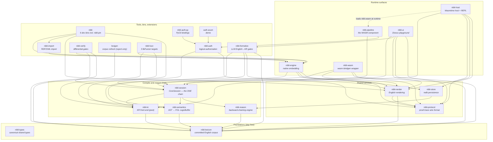

# Crate map

The workspace has **22 member crates** plus the deliberately excluded `fuzz/`
crate (root `Cargo.toml`: `exclude = ["fuzz"]`). Arrows below mean **“depends
on”** (normal `[dependencies]` only — dev-dependencies are covered separately).

Two legibility omissions, disclosed: **`nibli-types` edges are not drawn** —
most crates depend on it directly, and every crate except `nibli-lexicon` and
`lexigen` at least transitively (`nibli-store`, `nibli`, `nibli-auth-py`,
`auth-axum`, and `fuzz` reach it only through their deps) — and surfaces that
wrap `nibli-session` also depend directly on the stage crates (`nibli-kr` /
`nibli-semantics` / `nibli-reason`) for types and helpers — those direct edges
are omitted where the `session` edge already implies the chain. Each crate's
`Cargo.toml` is the full truth.

The dashed edge is the one non-Cargo relationship in the graph: `nibli-host`
does **not** link `nibli-pipeline` as a crate — it loads the built
`nibli.wasm` component at runtime via Wasmtime (`NIBLI_WASM_PATH`).

## Crate roster

Roles are taken from each crate's own top-of-file doc comment. **Tier** is the
crates.io publishing decision of record
([DOCS_TODO.md](https://github.com/dhilipsiva/nibli/blob/main/DOCS_TODO.md)):
Tier A is published to crates.io, in dependency order — see the
[API index](../api-index.md) for the live docs.rs links; Tier Z ships via
GitHub Release / site / repo only.

| Crate | Kind | Role | Tier |
|-------|------|------|------|
| `nibli-types` | lib | Canonical type definitions for the pipeline — one copy shared by every crate (`LogicBuffer`, `AstBuffer`, `NibliError`, shared arithmetic) | A |
| `nibli-lexicon` | lib | The committed English corpus: the dictionary is Rust source, const-validated, zero dependencies | A |
| `nibli-protocol` | lib | Proof-trace wire format (native serializes, browser deserializes); off-by-default `compute-client` feature holds the TCP client so wasm32 never pulls `std::net` | A |
| `nibli-kr` | lib | The nibli KR surface-syntax front-end; the pest grammar file is the executable, normative grammar | A |
| `nibli-semantics` | lib | Flat AST buffer → FOL `LogicBuffer` (an internal pipeline stage, not a standalone component) | A |
| `nibli-reason` | lib | The inference engine: demand-driven backward chaining over an indexed fact store, proof traces | A |
| `nibli-render` | lib | The one place engine output becomes English; rendering is pure — never mutates a verdict | A |
| `nibli-session` | lib | `CoreSession`: the single compile/assert/query chain every surface wraps — native↔WASM agreement by construction | A |
| `nibli-store` | lib (+ a v2-fixture seed bin) | Persistent redb store: ACID, postcard-serialized, tombstone retraction | A (parenthesized) |
| `nibli-engine` | lib | Native in-process embedding — no WASM, full stack traces; the anchor of the publish order | **A** |
| `nibli-formalize` | lib | The agentic English→KR formalizer engine (LLM behind real compile gates); UI shell lives in nibli-ui | A (optional) |
| `nibli-import` | lib | RDF Turtle / OWL import + fact export (the `nibli-import` *binary* lives in the `nibli` crate) | A (optional) |
| `nibli` | bin ×6 | Dev tooling: native REPL, `nibli-validate`, `nibli-import` CLI, `nibli-pin`, two bench bins | A (optional) |
| `nibli-pipeline` | cdylib+lib | **The** WASM component: chains kr → semantics → reason as internal crate deps; the only crate with WIT bindings | Z |
| `nibli-host` | bin | Native Wasmtime WASI P2 host + REPL; provides the `compute-backend` import | Z |
| `nibli-ui` | bin | The Dioxus Transparency Triad playground; engine compiled into the bundle, reasons fully in-browser | Z |
| `nibli-wasm` | cdylib+rlib | wasm-bindgen wrapper powering the live demo; mirrors nibli-engine's no-store path | Z |
| `nibli-verify` | lib+bin | The differential soundness gates (Vampire / clingo oracles, seam gate, corpus differentials) | Z |
| `nibli-auth` | lib | Built-in authorization over a warm session core; `publish = false` today | — |
| `nibli-auth-py` | cdylib | PyO3 extension `nibli_auth_native` (maturin); `publish = false` | — |
| `examples/auth-axum` | bin | Minimal axum demo for nibli-auth; `publish = false` | — |
| `tools/lexigen` | lib+bin | Corpus refresh tool (`just regen-lexicon`) — report-only, never rewrites entries, never a build-dep | Z |
| `fuzz/` (`nibli-fuzz`) | 3 fuzz bins | libFuzzer targets `fuzz_assert` / `fuzz_query` / `fuzz_nibli_kr`; excluded from the workspace | Z |

## Dev-dependency discipline

Several crates use the front-end as **dev-dependencies only**, keeping the
release graph a strict DAG while letting tests build buffers the shipped way:

- `nibli-kr` dev-depends on `nibli-semantics` (golden tests: every emitted
  buffer must be accepted by the semantic compiler).
- `nibli-reason` dev-depends on `nibli-kr` + `nibli-semantics` (tests build
  event-decomposed `LogicBuffer`s through the real front-end; the release
  build never links them).
- `nibli-render` dev-depends on `nibli-kr` + `nibli-semantics` for the same
  reason.

## Where the boundaries are

- **The one WASM boundary** is host ↔ `nibli-pipeline`. Everything inside the
  component (`nibli-kr` → `nibli-semantics` → `nibli-reason`) is plain Rust
  function calls — see [Pipeline & IR](pipeline-and-ir.md).
- **Foundations are dependency-free by design**: `nibli-lexicon` has zero
  dependencies; `nibli-types` only an optional `serde`.
- **`nibli-lexicon` is the single arity source** — `nibli-semantics` delegates
  to it instead of keeping a parallel arity map, and `lexigen` pins against
  the compiled corpus rather than parsing source.
