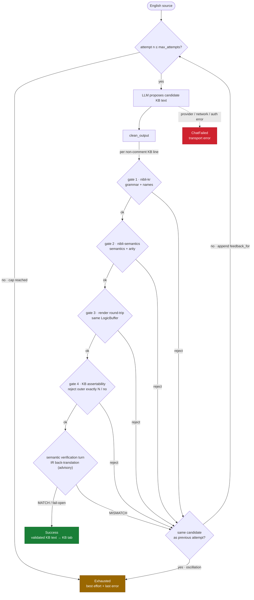

# nibli-formalize

The **agentic English→KB formalizer engine** for the Transparency Triad
(`fanva` = Lojban "translate" — the crate name predates THE FLIP). An LLM
formalizes English into **nibli KR**; the real Nibli compiler verifies every
candidate and feeds deterministic errors back until the KB text is valid.
Surfaced inside `nibli-ui` as **Formalize** mode (this crate holds no UI).
"Formalize", never "compile": the LLM step is interpretive and sits outside
the reasoning firewall, behind the deterministic gates below.

## The loop

Every candidate must clear a four-gate, fail-fast, local firewall:

1. `nibli_kr::parse_checked` — grammar and fail-closed name resolution.
2. `nibli_semantics::compile_from_ast` — semantics and arity.
3. The render round-trip gate — the canonical `nibli_kr::render` re-spelling
   must recompile to the same `LogicBuffer` (pure Rust, native and WASM).
4. The KB-assertability gate — query-only `exactly N` / `no` formulas in
   asserted position are rejected instead of being presented as persistent
   cardinality constraints. Opaque `fact { ... }` / `event { ... }` content
   remains quoted. If an exact source claim cannot be represented by explicit,
   source-supported ordinary facts, it stays an explicit unsupported failure;
   it is never silently omitted, weakened, or fabricated around.

A rejection feeds the gate's own message back through `gates::feedback_for`.
The LLM retries up to `max_attempts`, with an oscillation guard. A gate-clean
candidate then faces the semantic verification turn (`verify.rs`): a fresh
context judge reads the engine's IR-level back-translation of each KB line.
A mismatch retries through the same loop; verifier transport or parse failure
is best-effort/fail-open. This runs before the KB text is shown and is separate
from the engine's later nibli-kr → nibli-semantics → nibli-reason execution.

The compiler and round-trip portion is `gates::local_gates`; the full
assertion-authoring contract is `gates::validate` / `gates::validate_kb`.

## Test discipline

- Native `cargo test -p nibli-formalize --lib` (`just test-formalize`) covers
  local gates, the exact-count assertion guard, provider/agent behavior,
  bounded history, prompt grounding, and the semantic verification turn with
  mocked `chat()`.
- The shipped system prompt's examples and prose snippets are compiled by
  guard tests so prompting guidance cannot silently drift from the grammar.
